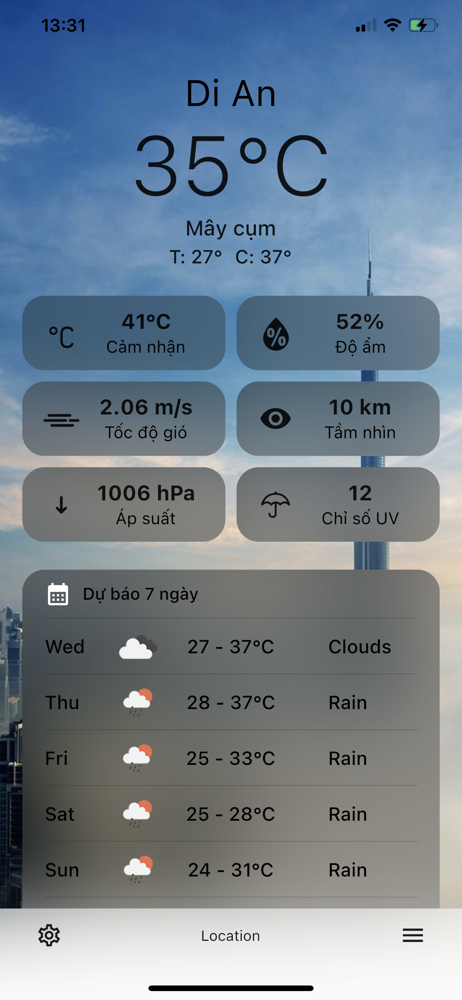

# FlutterWeather

Ứng dụng thời tiết đơn giản được tạo bằng [Flutter](https://flutter.dev/) và [Dart](https://dart.dev/) và sử dụng API từ [OpenWeatherMap](https://openweathermap.org/)

## Features
- [x] Tự động có vị trí người dùng,
- [x] Tìm kiếm vị trí
- [x] thông tin thời tiết hiện tại,
- [x] Thông tin thời tiết trong 7 ngày
## Todo
- [x] Thông tin thời tiết hàng giờ
- [x] Tìm kiếm và lấy thông tin thời tiết vị trí khác

## Screenshots

